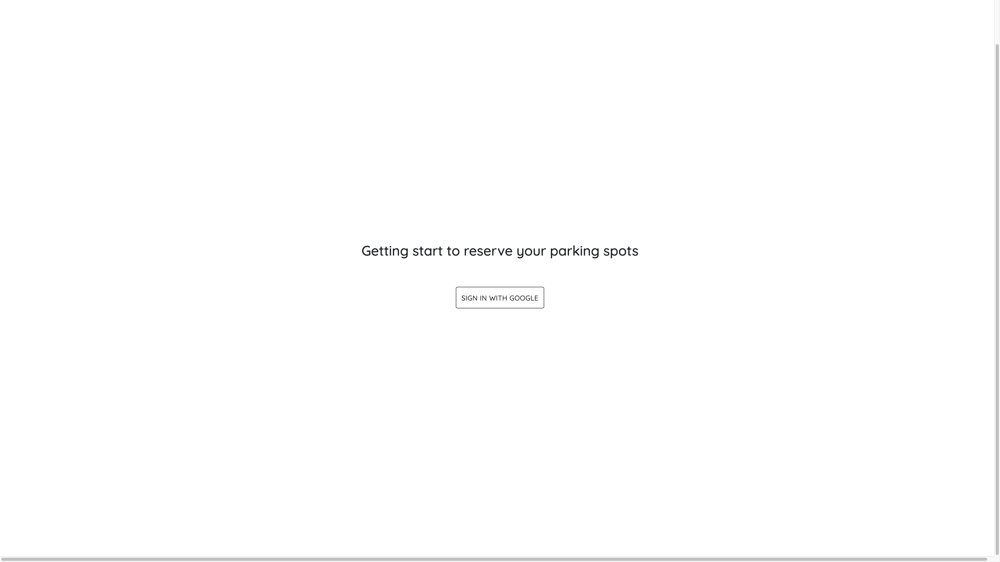
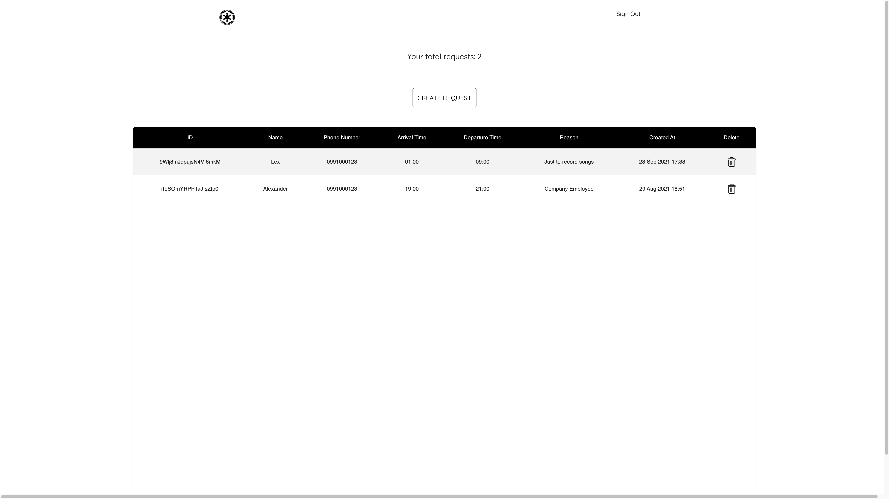
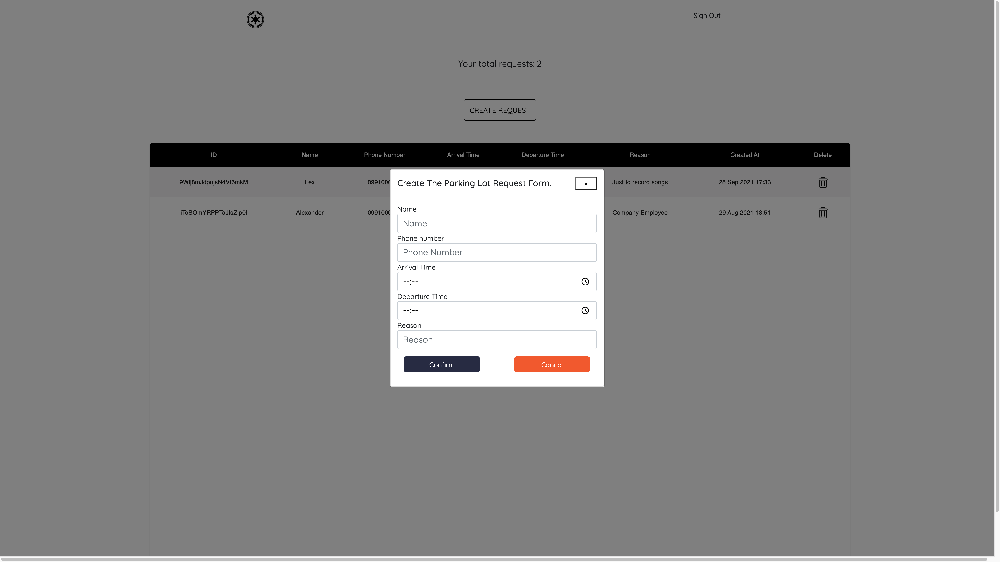

# Getting Started with Create React App

There are several libraries were used in this project. First, since it was bootstrapped using [Create React App](https://github.com/facebook/create-react-app)., it primary core of this project is using React. And, be advised React is not a framework, it is a library. Second, node-sass library is very important in this project to due to; it is leveraging SASS instead of CSS. Moreover, SASS is way more advance and nested style in style this web app. Third, the state management of this project is [Redux](https://redux.js.org/), it might be too overkill to use the Redux library in this small project however it is a good practice with enterprise standard. Fourth, [Firebase](https://firebase.google.com/) is the very service from Google to store database, storage, and Host web app. This project cannot be done without leveraging Firebase, it has free tier in which developers would not need to pay. However, if the requirement must use Cloud Functions, the pay as you go is a must.

### `Welcome to my web application final exam!`

I was assigned to do this task, which is the requesting form for reserve the parking lot. This web app page will be consisted of two pages. First, it will be a request form page for user to fill out the application before allowing to park. Second, the user wil be able to checkout in the tabular reports to view who are the customers during parking.

I have completed all requirements under the final exam task😼.

My name is SOKVATHARA LIN, I am a senior year student in Assumption University.
And, this is the very last examination in my 4th year before graduation.

Peace!😅🤗

I do have a demo web app which hosted on Firebase Hosting.

[Reserve Parking Web App](https://reserve-parking-b9087.web.app/)

